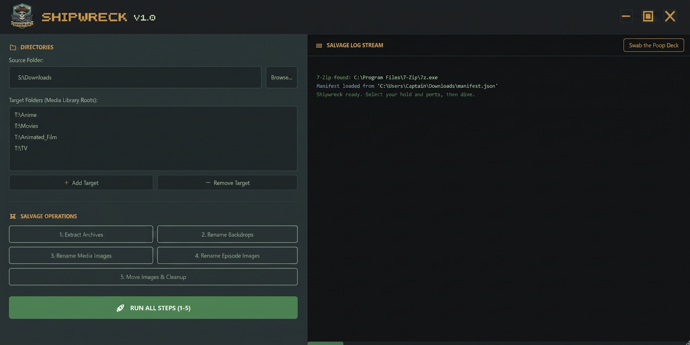

# ☠ SHIPWRECK v1.0

> *In the real world, shipwrecks act as time capsules, preserving history at the bottom of the ocean. Shipwreck is about preservation - finding, downloading, and locally saving high-quality artwork so your Jellyfin library looks perfect, even if online metadata sites ever go down.*

Shipwreck is a PowerShell GUI tool that renames and sorts media artwork downloaded from [Mediux](https://mediux.pro) into the correct folder structure for a [Jellyfin](https://jellyfin.org) media server.



---

## The Problem It Solves

Manually extracting, renaming, and placing custom media artwork - posters, backdrops, episode thumbnails - into the correct Jellyfin directory structure is slow and error-prone. Shipwreck automates everything after the download step, which remains the user's responsibility.

Mediux also has naming quirks: it converts colons to hyphens and sometimes drops the space before them, producing filenames like `Dragon Ball Z- Fusion Reborn (1995).jpg` instead of `Dragon Ball Z - Fusion Reborn (1995).jpg`. Shipwreck corrects all of this automatically before anything touches your media library.

### Source-First Processing

All renaming and organizing happens on the **source folder side first** before a single file is written to your target. This is intentional. If you run Jellyfin on a NAS, an external drive, or any storage where write cycles matter, Shipwreck minimizes unnecessary writes by ensuring every file is correctly named and routed before it leaves the source. Nothing is written to your media library until it is ready and in its final form.

### Single Lookup Per Operation

Shipwreck scans your target library directories exactly once per operation, regardless of how many steps you run. The result is cached and reused across all five steps. On large libraries spanning multiple drives, this makes a noticeable difference compared to tools that re-scan the library for every individual action.

---

## Features

| Step | Button | What it does |
|------|--------|-------------|
| 1 | Extract Archives | Matches `.zip/.rar/.7z` archives against your Jellyfin library and extracts them into named subfolders. Deletes the archive after successful extraction. |
| 2 | Rename Backdrops | Renames `* - Backdrop.ext` files to `backdrop.ext`. Moves loose backdrops directly to the correct show folder. |
| 3 | Rename Media Images | Renames season posters to `seasonXX-poster.ext`, Season 0 to `season-specials-poster.ext`, and show posters to `folder.ext`. |
| 4 | Rename Episode Images | Matches episode thumbnails to their video filenames using `SxxExx` pattern matching and renames them to `VideoFilename-thumb.ext`. |
| 5 | Move Images & Cleanup | Moves all processed images to the correct Jellyfin target folders. Cleans up empty source folders. |
| - | Run All Steps (1-5) | Runs the full pipeline in one click. |
| - | Swab the Poop Deck | Clears the log output. |

### Mediux Filename Normalization

Shipwreck uses a three-tier cascading match system to handle Mediux naming quirks:

- **Tier 1** - Exact match
- **Tier 2** - Spacing fix (`Dragon Ball Z- Fusion Reborn` -> `Dragon Ball Z - Fusion Reborn`)
- **Tier 3** - Loose match, strips hyphens and colons from both sides (`Fullmetal Alchemist- Brotherhood` -> `Fullmetal Alchemist Brotherhood`)

Each tier that fires is logged so you can always verify a match was correct.

---

## Requirements

- **Windows OS**
- **PowerShell 5.1+**
- **.NET Framework 4.5+**
- **[7-Zip](https://www.7-zip.org/)** - required for archive extraction only. `7z.exe` must be in your system PATH.

---

## Folder Structure

```
Shipwreck/
    Shipwreck.ps1
    manifest.json               <- auto-generated on first run (saves your source/target paths)
    shipwreck.log               <- auto-generated, saves full log output on close
    assets/
        Shipwreck_Badge.ico
        close.ico
        minimize.ico
        maximize.ico
        Porto_Buena.otf
        screenshots/
            shipwreck_preview.png
```

---

## Setup & Usage

**1. Run the script**
```powershell
powershell -Sta -File "Shipwreck.ps1"
```

Or create a desktop shortcut with this target:
```
powershell.exe -ExecutionPolicy Bypass -WindowStyle Hidden -Sta -File "C:\Path\To\Shipwreck.ps1"
```

**2. Set your Source Folder**

Where your Mediux downloads land (e.g. `F:\Downloads`).

**3. Add your Target Folders**

Your Jellyfin media library roots (e.g. `T:\Anime`, `T:\Movies`, `T:\TV`). Add as many as you need - Shipwreck searches all of them in a single scan.

**4. Run All Steps or step through individually**

Your source and target paths are saved automatically to `manifest.json` for future runs.

---

## Workflow Example

The user downloads artwork from Mediux manually and places it in their source folder:

```
Downloads/
    South Park (1997).zip
    Loki (2021) - Season 1.jpg
```

After running all steps:
- `South Park (1997).zip` is extracted and all images are renamed within the source folder
- Season posters are renamed to `season01-poster.jpg` before being moved
- Episode thumbs are matched to video filenames and renamed before being moved to the correct season subfolder
- `Loki (2021) - Season 1.jpg` is moved directly to `T:\TV\Loki (2021)\season01-poster.jpg`
- Empty source subfolders are deleted once all files have been moved

Nothing is written to your media library until each file is fully processed and in its final form.

---

## Supported File Types

| Type | Extensions |
|------|-----------|
| Images | `.jpg` `.jpeg` `.png` `.webp` |
| Video (for episode matching) | `.mkv` `.mp4` `.avi` `.mov` `.mpg` `.ts` |

> Files not matching these extensions will be ignored by the tool.

---

## Adding 7-Zip to Your System PATH

1. Download and install [7-Zip](https://www.7-zip.org/)
2. Open **Start** -> search **"Edit the system environment variables"**
3. Click **Environment Variables**
4. Under **System variables**, find and select **Path** -> click **Edit**
5. Click **New** and add `C:\Program Files\7-Zip`
6. Click OK on all windows and restart any open terminals
7. Verify by opening a new PowerShell window and typing `7z` - you should see 7-Zip usage info

---

## Notes

- Shipwreck **overwrites** existing artwork files by design - this is intentional for updating stale posters
- Back up your media library before first use if you want to be safe
- Episode thumbnails are only renamed if a matching video file is found in the target. Unmatched images are flagged in the log as *adrift at sea*
- The `manifest.json` config file saves in the same directory as the script

---

## Disclaimer

This tool performs file operations including deletion and overwriting. While tested extensively, you should back up your source and target directories before use, especially on first run. The author is not responsible for any data loss or misfiled content.
